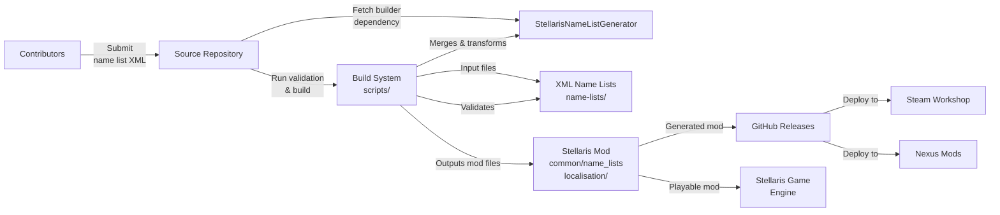
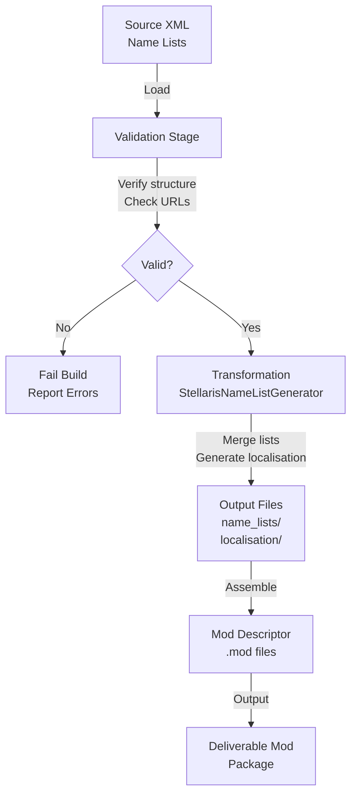
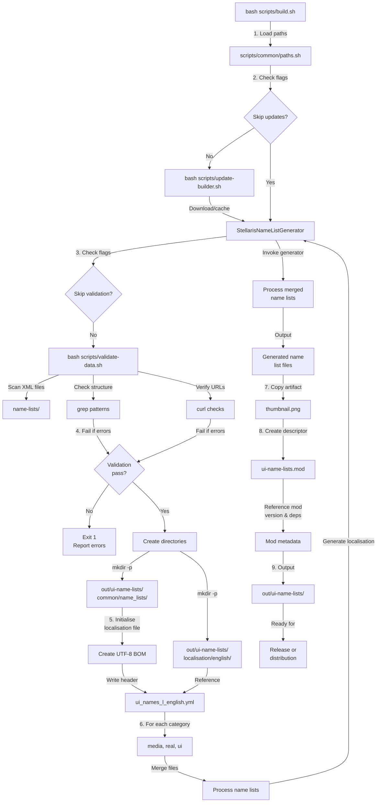
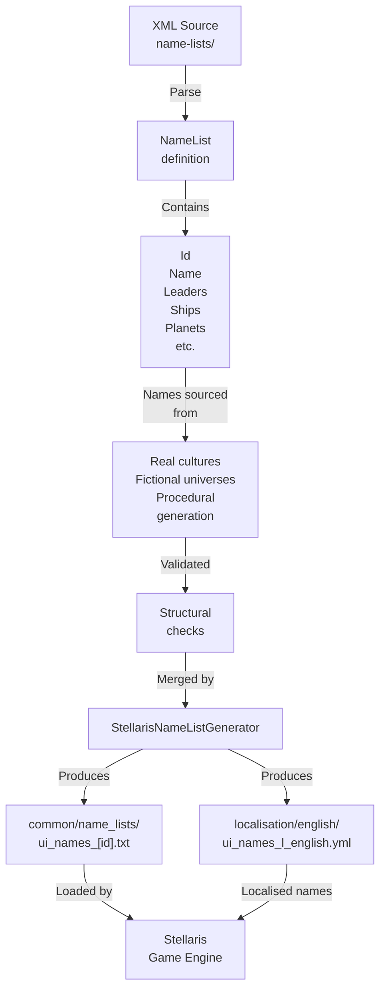
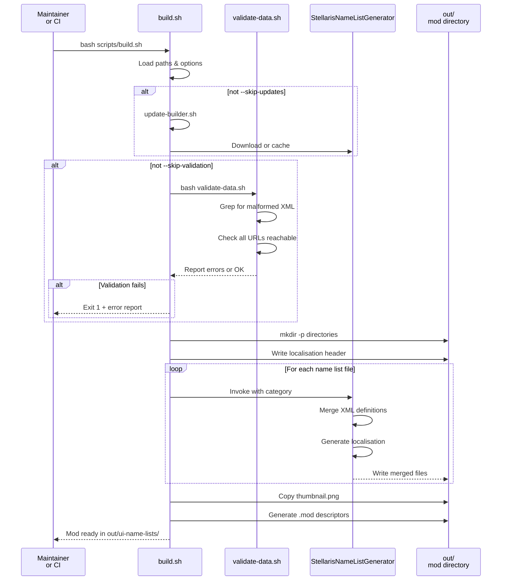

# Universum Infinitum: Name Lists Architecture

This document describes the current architecture of the Stellaris UI Name Lists modification project, detailing how source name list definitions are validated, merged, and generated into a Stellaris-compatible mod package.

## 📑 Table of Contents

- [Purpose](#-purpose)
- [System Context](#-system-context)
- [Architectural Style](#-architectural-style)
- [Runtime Flow](#-runtime-flow)
- [Architectural Areas](#-architectural-areas)
- [Data Architecture](#-data-architecture)
- [Interfaces and Integrations](#-interfaces-and-integrations)
- [Key Flows](#-key-flows)
- [Cross-Cutting Concerns](#-cross-cutting-concerns)

## 🎯 Purpose

This project provides a build and validation system that curates, validates, and transforms human-readable XML name list definitions into a deliverable Stellaris modification. The architecture enables centralised management of thousands of names across real-world cultures, fictional universes, and procedurally-generated species, with verification that all input conforms to expected XML structure before generating the mod output. The intended audience includes mod maintainers, contributors managing the name list sources, and Stellaris end users who consume the generated modification.

## 🌐 System Context

The system operates as a data transformation pipeline within a GitHub-hosted repository. External actors include:

- **Mod Maintainers:** Developers who invoke build scripts locally or via continuous integration to validate and generate the mod package.
- **Contributors:** Users who submit name list XML definitions via pull requests.
- **Stellaris Game Engine:** Consumes the generated mod files and exposes name lists during empire creation.
- **CI/CD Pipeline:** GitHub Actions workflows that automatically validate and publish the mod to distribution channels (Steam Workshop, Nexus Mods, Paradox Mods).
- **StellarisNameListGenerator:** External dependency (binary executable) that performs the core name list merging and localisation generation.

The principal external boundaries are:

- **StellarisNameListGenerator:** A remote binary executable (external dependency) consumed during the build phase. The system downloads this via `update-builder.sh` and invokes it to generate localisation strings and process name list definitions.
- **Stellaris Mod Format:** The output must conform to Stellaris's expected directory structure (`common/name_lists/`, `localisation/english/`) and descriptor format (`.mod` files).
- **CI/CD Distribution:** GitHub Actions workflows trigger automated publication to Steam Workshop, Nexus Mods, and Paradox Mods, passing the generated mod artefact as input.
- **Version Control:** Git repository serves as the single source of truth for all name list definitions and scripts.

## 🏗️ Architectural Style

The system implements a **Data Transformation Pipeline** architecture with integrated validation. Name list definitions flow through a series of discrete, ordered stages:

1. **Collection & Curation:** XML-based source definitions organised by category (real-world cultures, fictional universes, procedurally-generated species).
2. **Validation:** Structural and semantic checks verify XML correctness and URL accessibility before processing.
3. **Transformation:** The StellarisNameListGenerator merges category-specific name lists and generates localisation strings.
4. **Assembly:** Build scripts orchestrate directory creation, file merging, and Stellaris descriptor generation.
5. **Output & Distribution:** Generated mod files are packaged for release and distributed to multiple channels.

This pipeline ensures that invalid or incomplete source definitions are caught early and do not reach end users. The architecture isolates concerns: contributors edit XML definitions; the build system handles orchestration and validation; the generator handles domain-specific merging logic.

The principal architecture boundaries are:

- **Source Definitions (name-lists/):** Input boundary. Developers add new XML files; the build system treats them as read-only data sources.
- **Validation Layer (scripts/validate-data.sh):** Quality gate. Ensures all XML conforms to structural requirements and all referenced URLs are reachable before proceeding.
- **Transformation Layer (StellarisNameListGenerator):** External service boundary. Encapsulates game-specific logic for merging names and generating localisation keys.
- **Output Boundary (out/):** Transient; rebuilt on each build. Contains the final Stellaris mod directory structure ready for release.

## 🔄 Runtime Flow

The principal runtime sequence is:

1. **Initialisation:** Load configuration paths and parse command-line flags (`--skip-updates`, `--skip-validation`).
2. **Dependency Management:** Download or cache the StellarisNameListGenerator executable if not already present.
3. **Validation:** Scan all XML files in `name-lists/` for structural errors (malformed tags, empty elements, orphaned names) and verify all `<Url>` references are reachable.
4. **Directory Setup:** Create the output mod directory structure (`common/name_lists/`, `localisation/english/`) and initialise the localisation file with UTF-8 BOM and YAML header.
5. **Merge & Transform:** For each source category (media, real, ui), read XML definitions, invoke StellarisNameListGenerator to merge names and generate localisation entries.
6. **Assembly:** Copy supplementary files (thumbnail.png) and generate mod descriptors (`.mod` files) with metadata.
7. **Completion:** Output the finished mod directory to `out/ui-name-lists/`, ready for release or further processing by CI workflows.

## 🗂️ Architectural Areas

### Source Definitions (name-lists/)

Paths:
- `name-lists/media/` – Name lists derived from recognised science-fiction and fantasy intellectual properties.
- `name-lists/real/` – Name lists derived from real-world cultures, languages, and historical naming conventions.
- `name-lists/ui/` – Procedurally-generated or thematic name lists for Stellaris species and factions.
- `name-lists/generated/` – Name lists produced by external generators (reserved for future expansion).

Responsibilities:
- Store authoritative XML-format name list definitions, each defining a complete set of names for a specific category (e.g., dwarven names, Persian names, Gothic ship names).
- Document the source or inspiration (via `<Url>` elements) for each name list, enabling contributors to verify lineage and respect intellectual property.
- Provide clear, reusable name groups (Leaders, Ships, Planets, etc.) that Stellaris can consume.

Boundary rules:
- No runtime code generation or mutation; all definitions are static data files.
- Every XML file must contain at least one valid `<NameList>` element with an `<Id>` and `<Name>`.
- All referenced URLs must be resolvable and point to genuine sources (no placeholder or dead links).
- No external dependencies or imports within XML files; definitions must be self-contained.

### Build and Validation (scripts/)

Paths:
- `scripts/build.sh` – Principal build orchestrator; drives the entire pipeline.
- `scripts/validate-data.sh` – Structural and semantic validation of all XML definitions.
- `scripts/update-builder.sh` – Dependency management; downloads or caches the StellarisNameListGenerator.
- `scripts/common/paths.sh` – Shared configuration and path definitions.

Responsibilities:
- Orchestrate the build pipeline: validate → merge → transform → assemble.
- Verify that all input XML files conform to expected structure and content rules.
- Manage the external StellarisNameListGenerator dependency.
- Generate the Stellaris-compatible mod directory and descriptor files.

Boundary rules:
- Scripts are entry points; they do not directly implement name merging or game-specific transformation (delegated to StellarisNameListGenerator).
- All operations are idempotent: running the build multiple times produces identical output.
- Output is written to transient directories (`build/`, `out/`) which are safe to delete.
- Scripts must fail fast and report errors clearly if any validation step fails.

### External Dependency (StellarisNameListGenerator)

Paths:
- `.builder/StellarisNameListGenerator` – Cached binary executable.

Responsibilities:
- Merge multiple XML name list definitions into unified output files.
- Generate localisation strings (YAML format) for each name list ID.
- Apply game-specific logic for name list structure and format.

Boundary rules:
- Treated as a black box; the build system does not inspect or modify its implementation.
- Must be fetched from a stable, remote source during `update-builder.sh`.
- Input: XML files conforming to the expected schema.
- Output: Merged XML files and localisation YAML strings.

### Continuous Integration and Release (.github/workflows/)

Paths:
- `.github/workflows/build.yml` – Validates and builds the mod on every push and pull request.
- `.github/workflows/steam-workshop.yml` – Deploys the generated mod to Steam Workshop on release.
- `.github/workflows/nexus-mods.yml` – Deploys the generated mod to Nexus Mods on release.

Responsibilities:
- Trigger validation and build on repository changes.
- Run automated quality gates before merging pull requests.
- Publish built artefacts to distribution channels (Steam Workshop, Nexus Mods, Paradox Mods).

Boundary rules:
- CI workflows are downstream consumers of the build system; they invoke `scripts/build.sh` and propagate the generated `out/` directory.
- Deployment workflows operate only on tagged releases and require appropriate credentials and API keys.
- Each workflow is responsible for handling its own distribution channel's specific requirements.

## 💾 Data Architecture

Name lists are stored as XML files conforming to the StellarisNameListGenerator schema. Each file contains one `<ArrayOfNameList>` element with one or more `<NameList>` definitions. Each `<NameList>` specifies a unique `<Id>` (for Stellaris internals), a human-readable `<Name>`, and category-specific name groups (Leaders, Ships, Planets, etc.), each containing a set of candidate names.

| Data or Store | Owner | Representation and Storage | Lifecycle or Consistency |
|---------------|-------|----------------------------|--------------------------|
| XML Name List Definitions | Contributors | XML files in `name-lists/`. Each file defines names, sources, and categorisation. | Static; updated by pull requests. Validated on every build. |
| Real-World Culture Names | Contributor who added the file | XML file (e.g., `name-lists/real/persian.xml`). Sourced from historical and cultural references. | Preserved unchanged; maintained for historical and cultural accuracy. Immutable unless corrected for error. |
| Fictional Universe Names | Contributor and intellectual property holder | XML file (e.g., `name-lists/media/starwars.xml`). Derived from published fiction. | Preserved as-is; no transformation except what the generator applies. |
| Stellaris Mod Output | Build system | Directory tree: `common/name_lists/`, `localisation/english/`, `.mod` descriptors. | Transient; regenerated on each build. Output depends solely on input definitions. |
| Localisation Strings | Build system (generated from XML IDs) | YAML file `localisation/english/ui_names_l_english.yml`. Maps name list IDs to display names. | Generated; one entry per `<NameList>`. Regenerated on each build. |
| Mod Descriptor Metadata | Build system | Files: `ui-name-lists.mod`, `out/ui-name-lists/descriptor.mod`. Contain mod name, ID, version, dependencies. | Generated from script constants (`MOD_ID`, `MOD_NAME`, `STELLARIS_VERSION`). Updated when version requirements change. |

## 🔌 Interfaces and Integrations

| Interface or Integration | Direction | Contract | Owner | Failure Semantics |
|--------------------------|-----------|----------|-------|-------------------|
| XML Source Files | In | XML-formatted name list definitions conforming to the StellarisNameListGenerator schema. | Contributors and maintainers. | Build fails with validation error if XML is malformed or violates structural rules. |
| StellarisNameListGenerator Executable | In | Binary executable that reads XML and produces merged name lists and localisation YAML. | External dependency; managed via `update-builder.sh`. | Build fails with error if executable is unavailable or returns non-zero exit code. |
| Stellaris Mod Format | Out | Directory structure: `common/name_lists/` (name list files), `localisation/english/` (localisation file), `.mod` descriptor files. | Build system generates; Stellaris game engine consumes. | Mod fails to load in Stellaris if directory structure, file encoding (UTF-8 with BOM for localisation), or descriptor format is incorrect. |
| GitHub Releases | Out | GitHub API for publishing release assets (mod .zip archive). | CI/CD workflow (build.yml). | Release fails if API authentication fails or asset upload is rejected. |
| Steam Workshop | Out | Steam's HTTP API for mod upload and metadata update. | Deployment workflow (steam-workshop.yml); requires API credentials. | Deployment fails if Steam API is unreachable or credentials are invalid. |
| Nexus Mods | Out | Nexus Mods HTTP API for mod upload and versioning. | Deployment workflow (nexus-mods.yml); requires API key. | Deployment fails if Nexus API is unreachable, rate-limited, or credentials are invalid. |
| Paradox Mods (via GitHub) | Out | GitHub release assets consumed by Paradox Mods' syndication service. | CI/CD workflow (build.yml); Paradox Mods service periodically syncs. | Deployment occurs through automated syndication; failures are infrequent but may require manual intervention. |

## 🔑 Key Flows

### Build & Validation Flow

### Continuous Integration & Release Flow

On every push to `main`:

1. GitHub Actions triggers `build.yml`.
2. `build.yml` clones the repository, sets up Bash environment, and invokes `scripts/build.sh`.
3. Build succeeds (validated and generated mod artefact) or fails (report errors in workflow UI).

On tag release (e.g., `v1.2.3`):

1. `build.yml` runs, generating the mod.
2. `build.yml` creates a GitHub Release with the generated mod `.zip` archive as an asset.
3. `steam-workshop.yml` and `nexus-mods.yml` detect the release and automatically deploy to their respective platforms using API credentials.

### Contribution & Pull Request Flow

1. Contributor submits a pull request adding or modifying XML name list files in `name-lists/`.
2. GitHub Actions automatically triggers `build.yml` on the pull request commit.
3. `build.yml` runs validation and build; reports success or failure in the pull request checks.
4. If validation fails, the contributor sees the specific error (e.g., malformed XML, unreachable URL) and can iterate.
5. Once pull request passes all checks and is approved, maintainer merges.
6. Merged commit triggers another `build.yml` run (now on `main`), ensuring main branch is always buildable.

## 🔗 Cross-Cutting Concerns

### Error Handling & Validation

The system enforces strict validation before proceeding:

- **XML Structural Validation:** Regex patterns detect malformed tags, empty elements, and incorrectly nested tags (e.g., `<Name>` outside `<NameGroup>`).
- **URL Verification:** Every `<Url>` element is fetched via `curl` to verify reachability. Unreachable URLs cause build failure.
- **Schema Compliance:** XML files must conform to the StellarisNameListGenerator schema; violations are caught during parsing or transformation.
- **Fail-Fast:** Any validation error immediately terminates the build with a clear error message, preventing incomplete or corrupted mod output.

### Idempotency & Reproducibility

- **Clean Builds:** Output directories (`build/`, `out/`) are recreated on each build, ensuring no stale artefacts or state.
- **Deterministic Output:** Given identical input XML files, the build produces byte-identical output (modulo timestamps in metadata, if any).
- **Version Pinning:** External dependencies (StellarisNameListGenerator) are cached and versioned, ensuring consistent behaviour across invocations and machines.

### Localisation & Encoding

- **UTF-8 with BOM:** Localisation files are written with a UTF-8 byte-order mark (BOM) to ensure Stellaris interprets them correctly across platforms.
- **YAML Format:** Localisation strings conform to Stellaris's expected YAML structure (`l_english:` header followed by key-value pairs).
- **ID Mapping:** Each name list's XML `<Id>` is automatically mapped to a localisation key, with the `<Name>` as the displayed string in Stellaris.

### Maintainability & Extensibility

- **Modular Scripts:** Each script has a focused responsibility (building, validating, updating dependencies). New build steps can be added as separate shell functions.
- **Shared Configuration:** `scripts/common/paths.sh` centralises path definitions, reducing duplication and simplifying updates.
- **Category-Based Organisation:** Name lists are organised by category (real, media, ui). New categories can be added by creating new directories and updating the build merge loop.
- **External Tooling:** The StellarisNameListGenerator is a separate, independently maintained binary. Updating it is as simple as modifying the download URL in `update-builder.sh`.

### Distribution & Release Management

- **Multi-Channel Deployment:** Separate CI workflows handle Steam Workshop, Nexus Mods, and Paradox Mods, allowing independent release cadences and credentials.
- **Semantic Versioning:** Releases are tagged with version numbers (e.g., `v1.2.3`) and uploaded to GitHub Releases, making it easy for end users and tools to identify versions.
- **Stellaris Compatibility:** The mod descriptor specifies a `supported_version` (e.g., `v4.3.*`), ensuring only compatible Stellaris versions load the mod.
